# Multi-Perspective AI Reasoning System: Architecture Documentation

## 1. System Overview

The Perspective AI system is a multi-agent debate platform that processes user queries through a structured reasoning pipeline. It employs opposing AI agents (Expansion vs Compression) that iteratively refine their positions before a synthesis agent produces a balanced final answer.


---

## 2. Infrastructure Layer

### 2.1 Nginx Reverse Proxy

**Config**: `/etc/nginx/sites-available/perspective`

| Route | Target | Purpose |
|-------|--------|---------|
| `/` | `localhost:3000` | Next.js frontend |
| `/api/ws/` | `localhost:8000` | WebSocket (5min timeout) |
| `/api/` | `localhost:8000` | REST API |

**Key Settings**:
- WebSocket upgrade headers configured
- 300s read timeout for long-running debates
- `X-Real-IP` forwarding enabled

### 2.2 Service Management

| Service | Type | Port | Config |
|---------|------|------|--------|
| `perspective-frontend` | systemd | 3000 | `/etc/systemd/system/perspective-frontend.service` |
| `perspective-backend` | systemd | 8000 | `/etc/systemd/system/perspective-backend.service` |

---

## 3. Backend Architecture

### 3.1 Module Overview

```
backend/app/
├── main.py           # FastAPI endpoints, WebSocket, background tasks
├── state_machine.py  # Orchestrator (state transitions)
├── models.py         # Pydantic data structures
├── prompts.py        # Prompt templates for all agents
├── ollama_client.py  # LLM API communication (Telus)
├── session_store.py  # File-based session persistence
└── config.py         # Environment settings
```

### 3.2 API Endpoints

| Method | Endpoint | Purpose |
|--------|----------|---------|
| `GET` | `/api/health` | Health check |
| `GET` | `/api/diagnostic` | Deep health with LLM probe |
| `POST` | `/api/chat/init` | Start session, return clarification Qs |
| `POST` | `/api/chat/clarify` | Submit answers, trigger debate |
| `GET` | `/api/chat/{id}` | Get session state |
| `WS` | `/api/ws/{id}` | Real-time streaming |

### 3.3 WebSocket Message Types

| Type | Payload | When Sent |
|------|---------|-----------|
| `state_change` | `{state, session_id}` | State transition |
| `agent_output` | `{content, agent, round}` | After each agent |
| `synthesis` | `{content}` | Final output |
| `error` | `{error_message}` | On failure |

---

## 4. Data Models

### 4.1 SessionState (Enum)

```
INIT → CLARIFICATION_PENDING → CLARIFICATION_COMPLETE → ROUND_PROCESSING → SYNTHESIS_PROCESSING → COMPLETE
                                                                                                  ↓
                                                                                                ERROR
```

### 4.2 SessionData

| Field | Type | Description |
|-------|------|-------------|
| `session_id` | UUID | Unique identifier |
| `state` | SessionState | Current workflow state |
| `original_user_prompt` | string | Initial user input |
| `clarification_questions` | string | Generated questions |
| `clarification_answers` | string | User's answers |
| `merged_user_prompt` | string | Combined context |
| `current_round` | int | Active round (1-5) |
| `max_rounds` | int | Default: 5 |
| `history` | List[RoundOutput] | All agent outputs |

### 4.3 RoundOutput

| Field | Type | Description |
|-------|------|-------------|
| `round_number` | int | 1-5 for debate, 0 for synthesis |
| `agent` | AgentType | A/B/SYNTHESIS |
| `content` | string | Agent's response |
| `tokens_used` | int | Token count |
| `timestamp` | float | Unix timestamp |

---

## 5. State Machine Flow

### 5.1 StateMachineOrchestrator


### 5.2 Detailed Flow (Current + Planned)

> [!NOTE]
> Steps marked with 🆕 are **planned enhancements** not yet implemented.

1. **`process_init(session)`**
   - Input: Raw user prompt
   - Action: Generate clarification questions via LLM
   - Output: 3-5 clarifying questions
   - Next: `CLARIFICATION_PENDING`

2. **`process_clarification(session)`**
   - Input: User's answers
   - Action: Merge prompt + answers into `merged_user_prompt`
   - Next: 🆕 `process_meta_agent()` OR `process_round()`

3. 🆕 **`process_meta_agent(session)`** *(PLANNED)*
   - Input: Merged user prompt with full context
   - Action: Classify use case, score dimensions, select model
   - Output: JSON config with model choice + agent customizations
   - Next: `process_round()` with optimized configuration

4. **`process_round(session)`** (×5)
   - **Agent A (Expansion)**: Generates interpretations, options, emotional mapping
   - **Agent B (Compression)**: Condenses, validates, produces action plan
   - 🆕 Uses model selected by Meta-Agent (when implemented)
   - Both outputs streamed via WebSocket
   - Loop until `max_rounds`

5. **`process_synthesis(session)`**
   - Input: Full debate transcript
   - Action: Generate balanced final answer
   - Output: Integrated insights + next steps
   - End: `COMPLETE`

---

## 6. Prompt Architecture

### 6.1 Core Prompts (Current + Planned)

| Prompt | Agent | Purpose | Status |
|--------|-------|---------|--------|
| `CLARIFICATION_TEMPLATE` | Clarification | Extract missing context | ✅ Implemented |
| 🆕 `META_AGENT_PROMPT` | Meta-Agent | Classify use case, select model | 📋 Planned |
| `EXPANSION_SYSTEM_PROMPT` | Agent A | Broaden interpretations | ✅ Implemented |
| `COMPRESSION_SYSTEM_PROMPT` | Agent B | Narrow to action | ✅ Implemented |
| `SYNTHESIS_SYSTEM_PROMPT` | Synthesis | Merge perspectives | ✅ Implemented |

### 6.2 Key Design Patterns

- **Instruction Wrapping**: `[INST]...[/INST]` format
- **Scanner Mode**: Each agent detects reasoning flaws in opponent
- **Prohibited Behaviors**: No inventing facts, no extremes, no shaming
- **Output Structure**: Scripted formats for consistency

---

## 7. Frontend Architecture

### 7.1 Next.js Structure

```
src/
├── app/
│   ├── page.tsx        # Landing page
│   └── chat/
│       └── page.tsx    # Main chat interface
└── components/
    ├── chat/           # Chat-specific components
    ├── home/           # Landing page components
    └── backgrounds/    # Visual effects
```

### 7.2 Key Frontend Flow

1. User submits prompt → `POST /api/chat/init`
2. UI displays clarification questions
3. User submits answers → `POST /api/chat/clarify`
4. WebSocket connects → real-time agent streaming
5. Debate rounds displayed progressively
6. Final synthesis shown with action items

---

## 8. External Dependencies

### 8.1 LLM Provider (Telus AI API)

**File**: `ollama_client.py` (TellusAIClient)

| Model | Endpoint | Use Case |
|-------|----------|----------|
| `deepseek` | DeepSeek-V3.2-Exp | Default reasoning |
| `gemma` | Gemma-3-27B | Backup |
| `qwen-coder` | Qwen3-Coder-30B | Code-heavy |
| `gpt-oss` | GPT-OSS-120B | Alternative |

**Features**:
- Async HTTP via `httpx`
- Exponential backoff retry
- OpenAI-compatible `/completions` endpoint

### 8.2 Session Storage

**File**: `session_store.py`

- File-based JSON storage
- Path: Configured via `SESSION_STORAGE_PATH` env
- One JSON file per session UUID

---

## 9. Configuration

### 9.1 Backend Settings (`config.py`)

| Variable | Default | Description |
|----------|---------|-------------|
| `ollama_base_url` | (env) | LLM endpoint |
| `ollama_model` | (env) | Model name |
| `ollama_timeout` | 600.0 | Request timeout (s) |
| `ollama_max_retries` | 3 | Retry attempts |
| `ollama_retry_delay` | 2.0 | Base retry delay (s) |
| `session_storage_path` | (env) | JSON storage directory |
| `max_tokens` | 4096 | Max output tokens |
| `temperature` | 0.7 | Sampling temperature |
| `top_p` | 0.9 | Nucleus sampling |

---

## 10. Known Limitations

1. **No Persistence**: Sessions stored as JSON files, not database
2. **Single Model**: All agents use same LLM (no model routing)
3. **No Auth**: No user accounts or session ownership
4. **No Rate Limiting**: Vulnerable to abuse
5. **Synchronous Debate**: Rounds run sequentially, not in parallel

---

## 11. Meta-Agent Specification (PLANNED)

> [!IMPORTANT]
> This section documents a **planned enhancement**. Not yet implemented.

### 11.1 Purpose

The Meta-Agent is the "brain" that decides **HOW** to help, not **WHETHER** to help. It analyzes the clarified user input and outputs a JSON configuration that optimizes the debate for that specific use case.

### 11.2 Pipeline Position

```mermaid
flowchart LR
    A[User Input] --> B[Clarification Agent]
    B --> C[User Answers]
    C --> D[🆕 Meta-Agent]
    D --> E[Orchestrator]
    E --> F[Agent A + B Debate]
    F --> G[Synthesis]
```



### 11.3 Use Case Categories (8)

| Category | Description | Example Input |
|----------|-------------|---------------|
| `relationship` | Romantic, family, friendship conflicts | "My boyfriend dismisses my feelings" |
| `career` | Job decisions, workplace issues | "Should I take this promotion?" |
| `technical` | Code, engineering, debugging | "My API returns 500 errors" |
| `grief` | Loss, mourning, existential | "I lost my mother last month" |
| `health` | Physical/mental wellness | "I can't sleep and feel anxious" |
| `financial` | Money, investments, debt | "Should I buy or rent?" |
| `creative` | Art, writing, design decisions | "How do I structure my novel?" |
| `philosophical` | Ethics, meaning, abstract | "What makes a good life?" |

### 11.4 Scoring Dimensions (6)

| Dimension | Range | Low Example | High Example |
|-----------|-------|-------------|--------------|
| `emotional_complexity` | 1-10 | "Fix my code" | "I feel lost and hopeless" |
| `urgency` | 1-10 | "Someday I'd like to..." | "I need to decide TODAY" |
| `ambiguity` | 1-10 | "How do I sort an array?" | "I don't know what to do" |
| `stakeholder_count` | 1-10 | Just me | Family, boss, partner, kids |
| `reversibility` | 1-10 | "Which color?" | "Should I get married?" |
| `domain_expertise_required` | 1-10 | General life | Legal, medical, technical |

### 11.5 Model Selection Matrix

| Model | Provider | Best For | When to Use |
|-------|----------|----------|-------------|
| `gpt-oss-120b` | Telus Cloud | Empathy, nuance | emotional_complexity ≥ 7 |
| `deepseek-v3` | Telus Cloud | Reasoning, logic | ambiguity ≥ 7 |
| `gemma-3-27b` | Telus Cloud | Balanced | Default fallback |
| `qwen-coder-30b` | Telus Cloud | Technical | category == "technical" |
| `llama3.1:8b` | Local Ollama | Fast, simple | urgency ≥ 9, low complexity |
| `mistral:7b` | Local Ollama | General | Local fallback |

### 11.6 Output Schema

```json
{
  "category": "relationship",
  "scores": {
    "emotional_complexity": 9,
    "urgency": 6,
    "ambiguity": 7,
    "stakeholder_count": 3,
    "reversibility": 8,
    "domain_expertise_required": 2
  },
  "selected_model": "gpt-oss-120b",
  "model_rationale": "High emotional complexity requires empathetic reasoning",
  "agent_customizations": {
    "agent_a": {
      "focus": "validation-first",
      "tone": "warm, supportive"
    },
    "agent_b": {
      "focus": "boundary-focused",
      "tone": "gentle but direct"
    }
  }
}
```

### 11.7 Example Workflow

```
User: "I don't know what to do"

→ CLARIFICATION: "About what - relationship, career, technical problem?"

User: "My boyfriend keeps dismissing my feelings..."

→ META-AGENT Output:
  {
    "category": "relationship",
    "scores": { "emotional_complexity": 9, "urgency": 6, ... },
    "selected_model": "gpt-oss-120b",
    "agent_customizations": {
      "agent_a": { "focus": "validation-first" },
      "agent_b": { "focus": "boundary-focused" }
    }
  }

→ DEBATE runs on gpt-oss-120b with relationship-optimized configuration

→ SYNTHESIS outputs empathetic, actionable relationship advice
```

### 11.8 Implementation Requirements

| Component | File | Changes Needed |
|-----------|------|----------------|
| New prompt | `prompts.py` | Add `META_AGENT_PROMPT` |
| New state | `models.py` | Add `META_ANALYZING` state |
| New method | `state_machine.py` | Add `process_meta_agent()` |
| Model router | `ollama_client.py` | Support dynamic model selection |
| Config | `config.py` | Add model endpoint mappings |

---

*Document Version: 2.0 | Generated: 2026-01-25*
